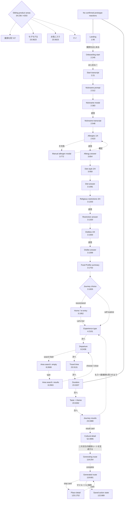

# TOKYO MOGU MOGU — Blind Figma Flow Baseline

Audit date: 2026-08-22 (Asia/Tokyo)  
Live file: `tokyo-mogu-mogu`  
File key: `fHqhA3d26OdXqm0cQxfK31`  
Requested starting node: `23:3207`  
Live file update timestamp exposed by Figma: `2026-08-15T18:11:17.262Z`

## Audit boundary and evidence rules

This is a blind reconstruction from the live Figma file. No application source, README, product documentation, existing audit, implementation map, Issue/PR content, test, deployment, Slack, presentation, or previous audit result was inspected.

Access-path reconciliation was performed before the audit:

- No KiKi/Figma bridge was exposed in the active MCP/tool connection inventory.
- Direct Figma REST returned `403`; no usable `FIGMA_ACCESS_TOKEN` was available to the process.
- The official Figma MCP returned the known Starter-plan quota error. This was not treated as a blocker.
- The public live Figma design and prototype viewers were accessible. Their live page tree, layer IDs/types/names, selected-node dimensions, rendered canvas, and 43-frame presentation inventory were inspected.

Evidence labels used below:

- **Tree** — live Figma page/layer tree, including raw node ID and layer type.
- **Canvas** — live selected-node canvas or live rendered frame.
- **Stepper** — live prototype presentation frame inventory and order.
- **Reaction test** — click performed in the live prototype with controls already visible; node URL and step remained unchanged.
- **Candidate transition** — supported by adjacent frames, repeated copy, state continuity, or an explicit CTA, but not by a Figma prototype reaction.

The prototype stepper is an inventory/presentation order, not a wired user flow. Reaction tests on `食旅をはじめる` in `1:95` and `次へ` in `23:3207` left the prototype at `1 / 43` and `25 / 43`, respectively.

## 1. Figma file, page, and section inventory

### File structure

| Item | Live evidence |
|---|---|
| File | `tokyo-mogu-mogu`, key `fHqhA3d26OdXqm0cQxfK31` |
| Editor | Figma Design |
| Pages | One page: `Page 1` |
| Figma SECTION nodes | None. Product groupings are spatial arrangements of top-level frames, not named SECTION layers. |
| Top-level layers | 45 direct children of `Page 1` |
| Presentation frames | 43; every top-level frame/auto-layout node is present in the prototype stepper |
| Non-frame top-level assets | Image `logo_mogu 1` (`1:467`) and instance `Status bar - iPhone` (`1:832`) |
| Device in presentation | `iPhone 14` |

### Complete top-level layer inventory

Layer order is the live `Page 1` tree order, not flow order.

| # | Layer name | Node ID | Figma kind | Product relevance |
|---:|---|---|---|---|
| 1 | `Talk1` | `125:1752` | Frame | Place-detail screen |
| 2 | `Frame 276` | `23:3623` | Frame | Explicit feature/IA reference board |
| 3 | `UX Decision Review • GitHub #203–#208` | `34:236` | Auto layout | Explicit unresolved UX-decision board |
| 4 | `Talk12` | `3:1952` | Frame | Home/re-entry surface |
| 5 | `logo_mogu 1` | `1:467` | Image | Logo asset only |
| 6 | `Status bar - iPhone` | `1:832` | Instance | Status-bar asset only |
| 7 | `Frame 8` | `1:23` | Auto layout | Older four-tab navigation component |
| 8 | `Frame 14` | `1:43` | Auto layout | Destination search-field component |
| 9 | `Talk1` | `8:2903` | Frame | Populated area-search overlay |
| 10 | `Talk1` | `8:2608` | Frame | Empty area-search overlay |
| 11 | `Frame 273` | `23:3620` | Auto layout | Route-generation CTA component |
| 12 | `Frame 236` | `52:4092` | Auto layout | Cultural-detail header component |
| 13 | `Frame 296` | `60:4385` | Auto layout | Mobile-width story-content block |
| 14 | `Frame 297` | `60:4426` | Auto layout | Horizontal story/reference board |
| 15 | `Frame 314` | `62:4615` | Auto layout | Nearby food/shop card strip |
| 16 | `Frame 315` | `62:4616` | Auto layout | Nature/experience card strip |
| 17 | `Frame 316` | `62:4830` | Auto layout | `周辺観光スポット` board |
| 18 | `Frame 317` | `62:4983` | Auto layout | `自然と散策` board |
| 19 | `Talk1` | `119:254` | Frame | Route-generation loading overlay |
| 20 | `Frame 318` | `122:889` | Auto layout | Saved-route action-bar state |
| 21 | `Talk1` | `119:681` | Frame | Generated itinerary/route screen |
| 22 | `Talk1` | `52:3995` | Frame | Cultural journey detail screen |
| 23 | `Talk1` | `23:3380` | Frame | Finder results screen |
| 24 | `Talk1` | `23:3262` | Frame | Taste/theme finder step |
| 25 | `Talk1` | `23:3207` | Frame | Duration finder step |
| 26 | `Talk1` | `23:3131` | Frame | Travel-time finder step |
| 27 | `Talk1` | `8:2436` | Frame | Departure finder step |
| 28 | `Talk1` | `4:2101` | Frame | Experience-type finder step |
| 29 | `Talk1` | `2:245` | Frame | Conversational onboarding start choice |
| 30 | `Talk3-1` | `3:772` | Frame | Manual allergen-entry modal |
| 31 | `Talk4` | `2:383` | Frame | Nickname-entry modal |
| 32 | `Talk6` | `3:1081` | Frame | Diet answer transcript state |
| 33 | `Talk5` | `3:959` | Frame | Diet-style question state |
| 34 | `Talk4` | `3:854` | Frame | Allergy answer transcript state |
| 35 | `Talk12` | `3:1835` | Frame | Post-profile journey-choice fork |
| 36 | `Talk11` | `3:1702` | Frame | Food Profile summary state |
| 37 | `Talk10` | `3:1599` | Frame | Disliked-food answer transcript state |
| 38 | `Talk9` | `3:1500` | Frame | Disliked-food question state |
| 39 | `Talk8` | `3:1320` | Frame | Religious-restriction answer state |
| 40 | `Talk7` | `3:1203` | Frame | Religious-restriction question state |
| 41 | `Talk3` | `2:623` | Frame | Allergy question state |
| 42 | `Talk3` | `2:548` | Frame | Nickname answer transcript state |
| 43 | `Talk3` | `2:312` | Frame | Nickname question state |
| 44 | `Talk2` | `2:21` | Frame | Onboarding confirmation transcript state |
| 45 | `welcome(CTA)` | `1:95` | Frame | Landing/welcome screen |

### Prototype presentation inventory

The live stepper contains these 43 frames, in this exact order:

1. `1:95` — `welcome(CTA)`
2. `2:245` — `Talk1`
3. `2:21` — `Talk2`
4. `2:312` — `Talk3`
5. `2:383` — `Talk4`
6. `2:548` — `Talk3`
7. `2:623` — `Talk3`
8. `3:854` — `Talk4`
9. `3:959` — `Talk5`
10. `3:1081` — `Talk6`
11. `3:1203` — `Talk7`
12. `3:1320` — `Talk8`
13. `3:1500` — `Talk9`
14. `3:1599` — `Talk10`
15. `3:1702` — `Talk11`
16. `3:1835` — `Talk12`
17. `3:772` — `Talk3-1`
18. `34:236` — UX Decision Review
19. `23:3620` — route-generation CTA
20. `52:4092` — detail header
21. `3:1952` — home
22. `4:2101` — experience type
23. `8:2436` — departure
24. `23:3131` — travel time
25. `23:3207` — duration
26. `8:2608` — empty area-search overlay
27. `23:3262` — taste/theme
28. `23:3380` — results
29. `52:3995` — cultural detail
30. `60:4426` — horizontal story board
31. `23:3623` — feature/IA reference board
32. `62:4830` — nearby-spots board
33. `8:2903` — populated area-search overlay
34. `62:4983` — nature/walk board
35. `119:254` — route-generation loading
36. `1:23` — older bottom navigation
37. `119:681` — generated route
38. `125:1752` — place detail
39. `60:4385` — vertical story block
40. `1:43` — destination field
41. `122:889` — saved-route action bar
42. `62:4615` — nearby food/shop cards
43. `62:4616` — nature/experience cards

The interleaving of modals, reference boards, and components proves that stepper order cannot itself be interpreted as a linear user journey.

## 2. Complete product screen and state inventory

All rows below are on `Page 1`; there is no containing Figma SECTION. Unless explicitly stated otherwise, destination references are candidate transitions only and persistent navigation is absent.

### A. Conversational onboarding / Food Profile family

All frames in this family are `390 × 844` and use a chat/conversational presentation.

| Frame / node | Purpose and entry | Visible state and exact decision-bearing copy | Actions, return behavior, destinations, navigation, ambiguity |
|---|---|---|---|
| `welcome(CTA)` `1:95` | Independent product landing entry | `東京のローカルな食文化を体験しよう。` / `食旅をはじめる` | Primary `食旅をはじめる`; candidate destination `2:245`. No back/skip/nav. Reaction test: no transition. |
| `Talk1` `2:245` | Introduce conversational setup | `MOGU MOGUへようこそ！😊 あなたにぴったりの東京の食文化や体験を見つけるために、まずはあなたの「食」のことを少しだけ教えてください。` | Primary `はじめる！` → candidate `2:21`; secondary `登録なし、自分で見てみる` has no represented destination. No back/nav. |
| `Talk2` `2:21` | Confirmation transcript after starting | User bubble `はい！はじめましょう！` | No visible control; candidate continuation `2:312`. |
| `Talk3` `2:312` | Ask for nickname | `まず、なんてお呼びすればいいですか？` | Candidate entry to nickname modal `2:383`; no explicit back/skip. |
| `Talk4` `2:383` | Nickname modal over dimmed chat | `私は...` / `ナナミ` / `です` | Primary `送信` → candidate `2:548`. No close icon or cancel is shown. Modal relationship: over `2:312`. |
| `Talk3` `2:548` | Nickname answer transcript | User bubble `私はナナミです😊` | Candidate continuation `2:623`; no visible control. |
| `Talk3` `2:623` | Food-allergy question, first profile step | `ナナミさん、よろしくお願いします！`; explanatory copy says answers can be changed after completion in `マイページ`; `まず、食物アレルギーはありますか？（複数選択）（1/4）`. Chips: `卵`, `乳製品`, `小麦`, `甲殻類`, `ナッツ`, `魚`, `アレルギーはありません`, `その他`. | Primary `送信` → candidate `3:854`. `その他` is the candidate entry to modal `3:772`. No back/nav. |
| `Talk4` `3:854` | Allergy answer transcript | User bubble `卵とナッツです` | Candidate continuation `3:959`; no visible control. |
| `Talk5` `3:959` | Everyday diet-style question | `普段の食事で、当てはまるものはありますか？（2/4）`. Choices: `ベジタリアン`, `ヴィーガン`, `ペスカタリアン`, `特になし`. | Selecting `特になし` is represented by the next transcript `3:1081`; no explicit reaction or back. |
| `Talk6` `3:1081` | Diet answer transcript | User bubble `特になし` | Candidate continuation `3:1203`; no visible control. |
| `Talk7` `3:1203` | Religious/avoidance question | `宗教上の理由などで、避けている食べものはありますか？（複数選択）（3/4）`. Chips: `豚肉`, `牛肉`, `ハラール対応が必要`, `アルコール`, `特になし`, `その他`. | Primary `送信` → candidate `3:1320`; no back/nav. |
| `Talk8` `3:1320` | Religious restriction answer transcript | User bubble `豚肉とハラール対応が必要` | Candidate continuation `3:1500`; no visible control. |
| `Talk9` `3:1500` | Disliked ingredient/taste question | `苦手な食材や味はありましたら、教えてください！（複数選択）（4/4）`. Chips: `生もの`, `辛いもの`, `発酵食品`, `苦いもの`, `貝類`, `特になし`, `その他`. | Primary `送信` → candidate `3:1599`; no back/nav. |
| `Talk10` `3:1599` | Disliked-food answer transcript | User bubble `生ものは苦手です` | Candidate continuation `3:1702`; no visible control. |
| `Talk11` `3:1702` | Food Profile completion summary | `ありがとうございます！あなたの食のプロフィールを登録しました。`; `あなたのFood Profile：`; `卵とナッツアレルギー`, `豚肉を避ける`, `ハラール対応が必要`, `生ものが苦手`; copy says the information is used only to make suitable recommendations. | Candidate continuation `3:1835`. Persistence/account ownership remains explicitly undecided on board `34:236` / item `#205`. |
| `Talk12` `3:1835` | Fork after setup completion | `では、今回はどんな食旅にしましょう？` | Primary `自分に合った旅をおすすめしてもらう！`; secondary `自分で旅を探す`. Neither destination is represented by a prototype reaction. No back/nav. |
| `Talk3-1` `3:772` | Manual allergen-entry modal | `食材を入力してください`; placeholder `アレルギー食材` | Primary `確定`; no close/cancel. Candidate return to the allergy question `2:623`; no wired destination. |

### B. Home, repeatable finder, detail, and route family

| Frame / node | Dimensions | Purpose and entry | Visible state and exact decision-bearing copy | Actions, return behavior, destinations, navigation, ambiguity |
|---|---:|---|---|---|
| `Talk12` `3:1952` | `390 × 1352` | Home/re-entry after setup or direct product entry | `こんにちは！ナナミさん あなただけの食旅を見つけよう!`; CTA `Let’s Go!`; `私の食旅 (過去の旅)`; repeated placeholder journey cards; `すべて見る` | `Let’s Go!` → candidate `4:2101`; `すべて見る`/cards have no wired destination. Home is a parent entry, not part of the restriction questionnaire. |
| `Talk1` `4:2101` | `390 × 844` | Finder step 1: experience type | `今回は、どんな食体験をしてみたいですか？`; `食べる` / `地元の料理を味わう`; `作る` / `地元の料理を味わう`; `買う` / `食材やお土産を買う`; `職人に会う` / `職人や生産者を訪ねる`; `産地を訪ねる` / `農園や産地を訪ねる`; `食文化を学ぶ` / `食の歴史や文化を知る` | Select card, then `次へ` → candidate `8:2436`; header back target unresolved. Progress indicator shown; no tab bar. |
| `Talk1` `8:2436` | `390 × 844` | Finder step 2: departure | `どこから出発しますか？`; search field `東京都` / `周辺` | Search field → overlay `8:2608`; `次へ` → candidate `23:3131`; `戻る` → candidate `4:2101`; header back unresolved. Progress indicator shown. |
| `Talk1` `8:2608` | `390 × 844` | Empty area-search overlay over departure step | `エリアを検索`; placeholder `エリア、場所、駅を入力` | `×` closes to candidate `8:2436`; typing produces candidate state `8:2903`. No submit control is shown. |
| `Talk1` `8:2903` | `390 × 844` | Populated area-search overlay | `エリアを検索`; query `東京駅`; first result `東京駅 (東京都　千代田区)`; six repeated placeholder-like location rows for `東京てレポート (東京都　江東区)`; software keyboard visible | Choose result → departure field destination is not represented; `×` closes to candidate `8:2436`. Repeated rows appear to be design data, not separate destinations. |
| `Talk1` `23:3131` | `390 × 844` | Finder step 3: one-way travel tolerance | `片道どのくらいまでなら移動できそうですか？`; `30分以内`, `1時間以内` (selected), `1時間30分以内`, `2時間以内`, `時間は気にしない` | `次へ` → candidate `23:3207`; `戻る` → candidate `8:2436`; header back unresolved. Progress indicator shown. |
| `Talk1` `23:3207` | `390 × 844` | Finder step 4: duration | `どのくらいの時間で楽しみたいですか？`; `半日`, `1日` (selected), `まだ決めていない` | `次へ` → candidate `23:3262`; `戻る` → candidate `23:3131`; header back unresolved. Reaction test: `次へ` did not transition. |
| `Talk1` `23:3262` | `390 × 1039` | Finder step 5: taste and theme | `今日は、どんな味とモチーフを楽しみたいですか？`; `1.好きな味は？（複数選択） 2/2`; taste chips `濃厚な味`, `やさしい味`, `甘いもの`, `香ばしいもの`, `辛いもの`, `発酵の味`, `さっぱりした味`, `素材の味を楽しみたい`, `おまかせ`; `2.気になるものテーマは？（複数選択） 2/2`; theme chips `伝統`, `飲食歴史`, `地域の日常`, `ものづくり`, `自然`, `季節・旬`, `農業・生産地`, `地元の人との交流`, `こだわりがない` | `次へ` → candidate `23:3380`; `戻る` → candidate `23:3207`. Vertical content exceeds the 844-pixel presentation viewport. Progress indicator shown. |
| `Talk1` `23:3380` | `390 × 1346` | Finder result list | `あなたに合う食の旅を見つけました！`; `結果:2件`; `もう一度食旅を見つけよう`; cards show `96% マッチ度` and `91% マッチ度`; first card `水がつなぐ、江戸から続く辛味` / `奥多摩のわさび文化をたどる`; second card `水が育てる、幻の川魚` | Rerun CTA → candidate `4:2101`; first card → candidate `52:3995`; second-card destination not designed. New four-tab navigation is visible at the bottom. Exact meaning of percentages is unresolved on board `34:236` / `#207`. |
| `Talk1` `52:3995` | `390 × 2089` | Cultural journey detail, entered from a result or potentially content exploration | `水がつなぐ、江戸から続く辛味`; `奥多摩のわさび文化をたどる`; `奥多摩わさびのストーリー`; story, basic information, nearby spots, and nature/walk content | Back arrow target unresolved; primary `この文化の食旅ルートを生成する` → candidate loading `119:254`; nearby/story cards have no wired targets. New bottom navigation is present. |
| `Talk1` `119:254` | `390 × 844` | Blocking loading overlay while generating a route | Dimmed cultural-detail screen, MOGU character and progress dots; `あなただけにぴったりの 観光ルートを生成中！` | No cancel/back/secondary action; candidate completion → `119:681`. |
| `Talk1` `119:681` | `390 × 1716` | Generated route/itinerary | `東京わさび文化を巡る旅`; day toggle `半日` / `一日`; map; route timeline from `奥多摩駅` through `奥多摩観光案内所`, `わさび食堂`, `奥多摩の台所`, `氷川渓谷`, `奥氷川神社`, `PORT OKUTAMA`; Goal `お疲れ様でした！`; summary `約 2.5 時間`, `徒歩約 6 km`, `6 スポット` | `ルートを再生成する`; stop cards → candidate place detail `125:1752`; `マイルートに保存` changes to saved component state `122:889`; `マイルートを見る` destination unresolved; back target unresolved. |
| `Talk1` `125:1752` | `390 × 1107` | Individual itinerary-stop/place detail | `奥多摩観光案内所`; image gallery; category tags; `基本情報`; `ガイドサービス（予約制）`; `公式サイトでガイドを予約する`; `ご注意` | Orange back control → candidate return `119:681`; bookmark toggles save state but persistence destination is unresolved; reservation CTA implies an external destination but none is represented. New bottom navigation visible. |

### C. Isolated components, content boards, and explicit reference boards

| Frame / node | Dimensions | Meaningful state/copy | Relationship and unresolved behavior |
|---|---:|---|---|
| `Frame 273` `23:3620` | `326 × 54` | CTA `この文化の食旅ルートを生成する` | Used by cultural detail `52:3995`; candidate entry to loading `119:254`. No reaction. |
| `Frame 236` `52:4092` | `390 × 53` Hug | Back header `水がつなぐ、江戸から続く辛味` | Header component for `52:3995`; back destination is not wired. |
| `Frame 296` `60:4385` | `390 × 1232.92` Hug | Vertical story block with `01.なぜ奥多摩で、わさびなのか`, `02.この文化をつなぐ人たち`, `03.受け継がれてきた技術`, `04.いま、直面している課題`, `05.私たちにできること` | Mobile content module used within `52:3995`; not an independent entry. |
| `Frame 297` `60:4426` | `1709 × 535.92` Hug | Horizontal board `奥多摩わさびのストーリー` containing the same five explicit story modules | Reference/content board; no navigation. |
| `Frame 314` `62:4615` | `1184 × 364` Hug | Nearby food/shop cards: `炉ばた あかべこ`, `山城屋`, `わさび食堂`, `奥多摩の台所`, `PORT OKUTAMA` | Source card strip for nearby content; card destinations absent. |
| `Frame 315` `62:4616` | `724 × 364` Hug | `Wasabi Experience（わさびブラザーズ）`, `氷川渓谷`, `奥氷川神社` | Source card strip for nature/experience content; card destinations absent. |
| `Frame 316` `62:4830` | `1136 × 380` Hug | Titled board `周辺観光スポット` with the five food/shop cards | Reference/layout board; no navigation. |
| `Frame 317` `62:4983` | `1136 × 380` Hug | Titled board `自然と散策` with the three nature/experience cards | Reference/layout board; no navigation. |
| `Frame 318` `122:889` | `390 × 73` Hug | Saved action bar `保存済み` / `マイルートを見る` | Alternate state of route completion actions in `119:681`; route-list destination absent. |
| `Frame 8` `1:23` | `390 × 84` Hug | Older tab bar `おすすめ`, `探す`, `お気に入り`, `マイ` | Conflicts with the newer visible tab labels and decision item `#203`; no tab destinations are wired. |
| `Frame 14` `1:43` | `390 × 83` Hug | `目的地`; field `浅草駅` / `周辺` | Isolated older destination-field component; not visibly used by the newer departure flow. |
| `Frame 276` `23:3623` | `740 × 1052` | Explicit feature note: `1. もぐもぐる` is a page for freely exploring food-culture articles, events, stores, and Workshop/experience information; `2. お気に入り` can save food-culture articles, customized food-journey routes, and stores/Workshop/Event items | This is IA guidance, not a runnable screen. |
| `UX Decision Review • GitHub #203–#208` `34:236` | `820 × 988` Hug | Six explicit decision items described in section 12 | Decision board, not a product screen. It records unresolved questions rather than approved behavior. |

## 3. Entry-point inventory

| Entry point | Node-ID evidence | What it enters | Confidence |
|---|---|---|---|
| Product landing | `1:95` | Conversational onboarding start `2:245` | Strong visual/copy continuity; no reaction |
| Registration-free branch | Secondary `登録なし、自分で見てみる` on `2:245` | Destination not represented | Unresolved |
| Post-profile recommendation branch | `自分に合った旅をおすすめしてもらう！` on `3:1835` | Likely recommendation/finder family | Semantic only; no destination |
| Post-profile self-explore branch | `自分で旅を探す` on `3:1835` | Likely independent browsing/finder entry | Semantic only; no destination |
| Home finder entry | `Let’s Go!` on `3:1952` | Finder step `4:2101` | Strong spatial/copy continuity; no reaction |
| Direct finder frame | `4:2101` | Repeatable five-step finder | Independent top-level screen and visible header `食旅を見つけ` |
| Finder rerun | `もう一度食旅を見つけよう` on `23:3380` | Finder restart, candidate `4:2101` | Explicit repeatability copy |
| Cultural-detail route generation | CTA component `23:3620` inside `52:3995` | Loading `119:254`, then route `119:681` | Strong state continuity; no reaction |
| Generated/saved route | `119:681`, saved variant `122:889` | Route timeline and place-detail sub-flow | Independent top-level route state |
| Place detail | Stop cards on `119:681` and place screen `125:1752` | Individual stop information | Strong matching content; no reaction |
| New bottom navigation | Visible in `23:3380`, `52:3995`, `125:1752`; labels addressed by `34:236/#203` | `食旅を見つけ`, `モグモグる`, `お気に入り`, `マイ` sibling areas | Destinations and formal mapping unresolved |
| Older bottom navigation | `1:23` | `おすすめ`, `探す`, `お気に入り`, `マイ` | Isolated legacy component; relationship to current IA unresolved |

## 4. Product information architecture

The strongest Figma-only IA is:

```text
TOKYO MOGU MOGU
├── Landing / setup
│   ├── Welcome (`1:95`)
│   ├── Conversational Food Profile (`2:245`–`3:1702`)
│   └── Post-setup fork (`3:1835`)
├── Home / re-entry (`3:1952`)
│   ├── Find a food journey
│   └── 私の食旅 (過去の旅)
├── 食旅を見つけ — repeatable recommendation/finder
│   ├── Experience (`4:2101`)
│   ├── Departure + search overlay (`8:2436`, `8:2608`, `8:2903`)
│   ├── Travel time (`23:3131`)
│   ├── Duration (`23:3207`)
│   ├── Taste/theme (`23:3262`)
│   ├── Results (`23:3380`)
│   └── Cultural detail (`52:3995`)
│       └── Generate route (`119:254` → `119:681`)
│           └── Stop/place detail (`125:1752`)
├── モグモグる — sibling content-exploration area (`23:3623`)
├── お気に入り — sibling saved-content area (`23:3623`, `122:889`)
└── マイ — profile/settings sibling referenced by onboarding (`2:623`)
```

Structural conclusions, with node evidence:

1. **Food restrictions are setup/profile data, not the permanent first step of every journey search.** The restrictions are captured in a conversational Food Profile (`2:623`–`3:1702`), while the finder starts independently at Home/experience selection (`3:1952`, `4:2101`).
2. **There is no Figma “diagnosis” screen.** The result screen is a two-item journey recommendation list (`23:3380`), not a dietary diagnosis.
3. **The finder is repeatable.** `23:3380` explicitly shows `もう一度食旅を見つけよう`, returning conceptually to the finder start `4:2101`.
4. **Route generation is a subordinate flow launched from a cultural detail.** The CTA `23:3620` appears with detail `52:3995`, followed by loading `119:254` and generated route `119:681`.
5. **A place detail is subordinate to a generated route.** The stop list in `119:681` and matching `奥多摩観光案内所` detail `125:1752` establish this relationship.
6. **`モグモグる` and `お気に入り` are siblings of the finder, not steps after restrictions or results.** This is stated by reference board `23:3623` and reinforced by bottom-navigation decision item `34:236/#203`.
7. **Persistence semantics are not locked.** Board `34:236/#205` explicitly asks whether nickname ownership is local/account/session and what “registration-free” means. Board `34:236/#204` similarly leaves recent journeys, past journeys, bookmarks, and saved routes unresolved.

## 5. Mermaid user-flow graph

All dashed arrows below are candidate transitions reconstructed from live visual/copy continuity. Figma does not contain confirmed prototype reactions for these CTAs.



## 6. Detailed transition table

`Reaction` is `None` throughout: no destination reaction was exposed by the live prototype. “Candidate destination” is therefore a cartographic reconstruction, not a claim of prototype wiring.

| Source | Trigger | Candidate destination | Back/close/return | Evidence |
|---|---|---|---|---|
| `1:95` | `食旅をはじめる` | `2:245` | None shown | Spatial/Stepper continuity; reaction test stayed at `1:95` |
| `2:245` | `はじめる！` | `2:21` | None shown | Adjacent transcript state |
| `2:245` | `登録なし、自分で見てみる` | Unresolved | None shown | No destination frame/reaction identified |
| `2:21` | Conversation advances | `2:312` | None shown | Transcript continuity |
| `2:312` | Nickname input | modal `2:383` | Modal has no close/cancel | Matching prompt and overlay |
| `2:383` | `送信` | `2:548` | No cancel | Matching `私はナナミです😊` transcript |
| `2:623` | `その他` | modal `3:772` | `確定` conceptually returns to `2:623` | Matching custom allergen copy |
| `2:623` | `送信` | `3:854` | None shown | Matching selected allergy transcript |
| `3:959` | Choose `特になし` | `3:1081` | None shown | Exact answer transcript |
| `3:1203` | `送信` | `3:1320` | None shown | Exact answer transcript |
| `3:1500` | `送信` | `3:1599` | None shown | Exact answer transcript |
| `3:1702` | Conversation advances | `3:1835` | Profile edits are only described as later available in `マイページ` | Adjacent completion/fork state |
| `3:1835` | `自分に合った旅をおすすめしてもらう！` | Possibly `3:1952` or finder family | Unresolved | Semantic only |
| `3:1835` | `自分で旅を探す` | Possibly `4:2101` or `モグモグる` | Unresolved | Semantic only |
| `3:1952` | `Let’s Go!` | `4:2101` | Home remains likely parent return, but not represented | Strong spatial/copy continuity |
| `4:2101` | Choose experience + `次へ` | `8:2436` | Header back target unresolved | Sequential finder layout |
| `8:2436` | Search field | `8:2608` | Overlay `×` returns to `8:2436` | Explicit dimmed-background overlay |
| `8:2608` | Type `東京駅` | `8:2903` | `×` returns to `8:2436` | Empty/populated variants |
| `8:2903` | Choose result | `8:2436` with selected departure | `×` returns to `8:2436` | Expected state implied; selected-state frame not drawn |
| `8:2436` | `次へ` | `23:3131` | `戻る` → candidate `4:2101` | Sequential finder layout |
| `23:3131` | `次へ` | `23:3207` | `戻る` → candidate `8:2436` | Sequential finder layout |
| `23:3207` | `次へ` | `23:3262` | `戻る` → candidate `23:3131` | Sequential finder layout; reaction test stayed at `23:3207` |
| `23:3262` | `次へ` | `23:3380` | `戻る` → candidate `23:3207` | Sequential finder/results continuity |
| `23:3380` | `もう一度食旅を見つけよう` | `4:2101` | Header back unresolved | Explicit repeat action |
| `23:3380` | First result card | `52:3995` | Detail back target likely `23:3380`, not wired | Exact matching title/content |
| `52:3995` | `この文化の食旅ルートを生成する` | `119:254` | Detail back target unresolved | CTA component `23:3620` plus loading overlay |
| `119:254` | Generation completes | `119:681` | No cancel/back | Loading copy plus generated route |
| `119:681` | `ルートを再生成する` | Possibly loading `119:254` then refreshed `119:681` | Remains in route family | Explicit action, no alternate generated state |
| `119:681` | Stop card | `125:1752` | Place back → candidate `119:681` | Exact matching stop/place title |
| `119:681` | `マイルートに保存` | `122:889` saved component state | `マイルートを見る` destination unresolved | Explicit unsaved/saved component variants |
| `125:1752` | `公式サイトでガイドを予約する` | External site, URL absent | Back → candidate `119:681` | External-action wording only |
| Any new tab bar | Tab selection | `食旅を見つけ` / `モグモグる` / `お気に入り` / `マイ` | Persistent sibling navigation | Labels visible/referenced; destinations absent |

## 7. Repeatable flows

1. **Food-journey finder** — `4:2101` → `8:2436` → `23:3131` → `23:3207` → `23:3262` → `23:3380`. Repeatability is explicit in `もう一度食旅を見つけよう` on `23:3380`.
2. **Area search within departure** — `8:2436` ↔ `8:2608` → `8:2903` ↔ `8:2436`. It is an overlay sub-flow and can be reopened.
3. **Route generation/regeneration** — `52:3995` → `119:254` → `119:681`; route screen `119:681` also exposes `ルートを再生成する`.
4. **Route stop inspection** — `119:681` ↔ `125:1752` is a repeatable per-stop sub-flow by content structure, though only one stop-detail screen is drawn.
5. **Save-state toggle** — route completion actions have unsaved and `保存済み` variants (`119:681`, `122:889`). The persistence store is not defined.

## 8. One-time/setup flows

The conversational Food Profile family (`2:245`–`3:1702`) is visually and linguistically a setup flow: it introduces the user, asks a nickname, collects four numbered restriction/preference categories, and finishes with `あなたの食のプロフィールを登録しました。`

It should not be described as definitively one-time at the persistence level. Board `34:236/#205` explicitly leaves nickname ownership (`local/account/session`) and registration-free semantics undecided. The safest Figma-only conclusion is:

- Intended UX role: onboarding/setup.
- Repeat frequency: not specified.
- Edit behavior: copy in `2:623` says completed answers can later be changed in `マイページ`.
- Account/local persistence: unresolved.

## 9. Modal and conversational flows

| Type | Nodes | Behavior represented |
|---|---|---|
| Conversational setup | `2:245`–`3:1835` | Bot/user transcript, sequential questions, no persistent navigation |
| Nickname modal | `2:383` over `2:312` | Dimmed chat; `送信`; no cancel/close shown |
| Manual allergen modal | `3:772` over allergy conversation | Text field + `確定`; no cancel/close shown |
| Area-search overlay | `8:2608`, `8:2903` over `8:2436` | Empty and populated states; explicit `×` close; keyboard in populated state |
| Route-generation overlay | `119:254` over `52:3995` | Blocking progress state; no cancel/back |

No confirmation dialog, error dialog, zero-results state, or failed-generation state is present.

## 10. Branches and forks

1. **Start fork (`2:245`)**: `はじめる！` versus `登録なし、自分で見てみる`. Only the onboarding branch has subsequent frames.
2. **Custom allergen branch (`2:623`)**: standard chips versus `その他` → manual-entry modal `3:772`.
3. **Post-profile fork (`3:1835`)**: recommendation (`自分に合った旅をおすすめしてもらう！`) versus self-directed exploration (`自分で旅を探す`). Neither destination is drawn as a reaction.
4. **Finder choices (`4:2101`, `23:3131`, `23:3207`, `23:3262`)**: multiple option branches converge on one next screen; no alternative result branches are drawn.
5. **Result fork (`23:3380`)**: open one of two recommendation cards or restart the finder. Only the first result has a matching detailed screen.
6. **Detail fork (`52:3995`)**: consume story/nearby content or generate a route.
7. **Route fork (`119:681`)**: inspect stops, regenerate, save, or view the saved route. Only one stop detail and one saved action state are drawn.
8. **Persistent navigation fork**: sibling areas are represented, but the final mapping remains an explicit decision item (`34:236/#203`).

## 11. Disconnected and orphaned screens

No verified prototype reaction connects any inspected CTA. Therefore “disconnected” has two levels:

### Presentation-enumerated but reaction-unwired product screens

All 43 frames are reachable manually through the prototype stepper, but representative CTA tests did not navigate. The intended sequences in sections 5–6 are evidence-backed reconstructions, not live reaction edges.

### Isolated/reference-only frames

- `23:3620` — route-generation button only.
- `52:4092` — detail header only.
- `60:4385`, `60:4426` — story modules/boards.
- `62:4615`, `62:4616`, `62:4830`, `62:4983` — nearby/nature card strips and boards.
- `122:889` — saved-route action state only.
- `1:23` — older tab bar not visibly attached to the newer finder IA.
- `1:43` — older destination field using `浅草駅`, separate from the current departure design.
- `23:3623`, `34:236` — explicit product/decision reference boards.
- `1:467`, `1:832` — top-level image/instance assets, not screens and not in the prototype stepper.

### Product states not represented anywhere

- Zero finder results.
- Finder error or recommendation failure.
- Route-generation error, retry, or cancellation.
- Empty/past-journey/favorites collections.
- Login/account creation and persistence confirmation.
- Detail for the second recommendation.
- Detail screens for route stops other than `奥多摩観光案内所`.
- Explicit post-completion return destination for onboarding, finder detail, or route generation.

## 12. Explicit UX decision and reference boards

### UX Decision Review (`34:236`)

The board itself states that Figma is the visual/interaction discussion location and GitHub is the final decision record. No Issue content was opened in this audit. The six visible items are questions, not locked decisions:

1. **`#203 Bottom Navigation / 底部導覽`** (`34:239`–`34:242`): determine whether the four Figma tabs are label changes or an IA change; explicitly maps `食旅を見つけ / モグモグる / お気に入り / マイ` to the formal product IA.
2. **`#204 MOGU・過去の旅・お気に入り / 歷史與收藏`** (`34:243`–`34:246`): define ownership and distinction among Recent, past journeys, bookmark, and Saved Routes.
3. **`#205 Onboarding nickname / 暱稱與免註冊流程`** (`34:247`–`34:250`): decide whether nickname is required, whether ownership is local/account/session, and the real meaning of registration-free/skip copy.
4. **`#206 Exploration taxonomy / 推薦條件`** (`34:251`–`34:254`): decide which experience, departure, travel-time, taste, and theme fields become formal recommendation factors and which are phased.
5. **`#207 96% マッチ度 / 推薦匹配度`** (`34:255`–`34:258`): decide whether the percentage is a formal score or should become a qualitative match/explainable recommendation reason.
6. **`#208 Figma fidelity × production constraints`** (`34:259`–`34:262`): define adaptation rules for `390→375px`, `ja/en/zh-TW`, WCAG, and focus states.

### Feature/IA note (`23:3623`)

The live board states:

- `1. もぐもぐる`: a page for users to freely explore content such as regional food-culture/food articles, event information, related store information, and Workshop/experience information. It compares the intended home composition to a travel/experience platform.
- `2. お気に入り`: expected saveable content includes food-culture articles, a food-journey route customized each time, and favorite stores/Workshop/Event items.

This board supports sibling-feature IA, but it does not resolve the ownership questions raised in `34:236/#204`.

### Content/reference boards

- `60:4426` makes the five-part `奥多摩わさびのストーリー` structure explicit.
- `62:4830` fixes the `周辺観光スポット` candidate set.
- `62:4983` fixes the `自然と散策` candidate set.
- `60:4385`, `62:4615`, and `62:4616` are mobile/content-source variants of those boards.

## 13. Ambiguity register

| ID | Ambiguity | Live node evidence | Safe conclusion |
|---|---|---|---|
| A1 | Prototype destinations | `1:95`, `23:3207`, 43-step presentation | No confirmed reaction edges; use candidate transitions only. |
| A2 | Whether Food Profile is truly one-time | `2:623`–`3:1702`; `34:236/#205` | It is setup-shaped, but persistence/repeat frequency is unresolved. |
| A3 | Registration-free destination | `2:245` | `登録なし、自分で見てみる` has no destination frame/reaction. |
| A4 | Post-profile fork destinations | `3:1835` | Recommendation and self-explore branches are explicit; targets are not. |
| A5 | Bottom-nav labels/IA | Older `1:23` versus newer screens and `34:236/#203` | Two generations coexist; final mapping is undecided. |
| A6 | Recent/past/saved/favorite ownership | `3:1952`, `119:681`, `122:889`, `23:3623`, `34:236/#204` | These are represented concepts, not a finalized data model. |
| A7 | Finder-factor semantics | `4:2101`, `8:2436`, `23:3131`, `23:3207`, `23:3262`; `34:236/#206` | Inputs are in the UX, but formal recommendation-factor scope is undecided. |
| A8 | Percentage meaning | `23:3380`; `34:236/#207` | `96%`/`91%` are visible, but score semantics are explicitly unresolved. |
| A9 | Return destinations | Back controls in `4:2101`–`125:1752` | Back/return behavior is visually present but not wired; destinations remain candidates. |
| A10 | Search-result data quality | `8:2903` | First result is meaningful; repeated `東京てレポート` rows appear placeholder-like. Do not infer separate locations. |
| A11 | Decision-board authority | `34:236` | The board explicitly calls GitHub the final decision record, but Issue contents were outside this blind audit. Treat its six items as unresolved questions, not approvals. |
| A12 | Long-screen scrolling | `23:3262`, `23:3380`, `52:3995`, `119:681`, `125:1752` | Frames exceed the 844-pixel device viewport; scroll behavior is implied by frame height, not prototype interaction. |
| A13 | Second-result/detail coverage | `23:3380`, `52:3995` | Only the first result has a matching detail screen. |
| A14 | Completion return after route generation | `119:254`, `119:681` | Generation ends at a route screen; no automatic return to home/detail/results is represented. |
| A15 | Fidelity/adaptation behavior | `34:236/#208` | 375px, localization, WCAG, and focus-state rules are not finalized in Figma. |
| A16 | Old and new design generations | Chat family, older components `1:23`/`1:43`, newer finder/route family | They coexist on one page; Figma does not label either family deprecated. |

## 14. Node-ID evidence for structural conclusions

| Structural conclusion | Supporting node IDs |
|---|---|
| One-page file with no SECTION layers | `Page 1`; all 45 top-level IDs in section 1 |
| Setup/profile flow is distinct from finder | `2:245`–`3:1835` versus `3:1952`, `4:2101`–`23:3380` |
| Restrictions do not permanently precede every search | Food Profile ends at `3:1835`; repeatable finder has its own entry `4:2101` and rerun `23:3380` |
| Result is a journey recommendation, not diagnosis | `23:3380` |
| Finder is repeatable | `23:3380` (`もう一度食旅を見つけよう`) → conceptual restart `4:2101` |
| Search is a modal sub-flow | `8:2436`, `8:2608`, `8:2903` |
| Route generation is subordinate to cultural detail | `52:3995`, CTA `23:3620`, loading `119:254`, route `119:681` |
| Place detail is subordinate to generated route | `119:681`, `125:1752` |
| Saved state is an alternate route state | `119:681`, `122:889` |
| `モグモグる` and `お気に入り` are sibling features | `23:3623`; navigation decision `34:236/#203`; saved-content decision `34:236/#204` |
| Bottom navigation is not finalized | Older component `1:23`; newer navigation visible in `23:3380`, `52:3995`, `125:1752`; `34:236/#203` |
| Recommendation taxonomy and score remain undecided | `34:236/#206`, `34:236/#207`; input/result nodes `4:2101`, `8:2436`, `23:3131`, `23:3207`, `23:3262`, `23:3380` |
| Prototype is presentation-enumerated but reaction-unwired | 43-frame stepper; reaction tests `1:95`, `23:3207` |

The complete product-relevant live Figma inventory was inspected from the file root: the sole page, all 45 top-level nodes, all 43 presentation frames, alternate modal/loading/saved states, isolated components, and explicit UX/reference boards.

FIGMA_BASELINE_COMPLETE: YES
