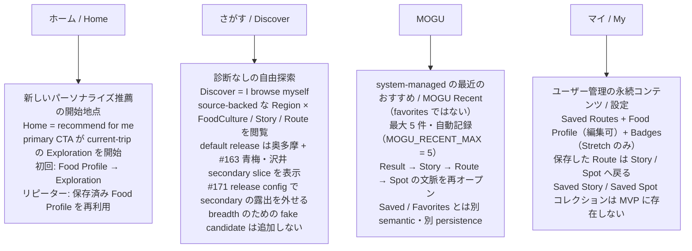
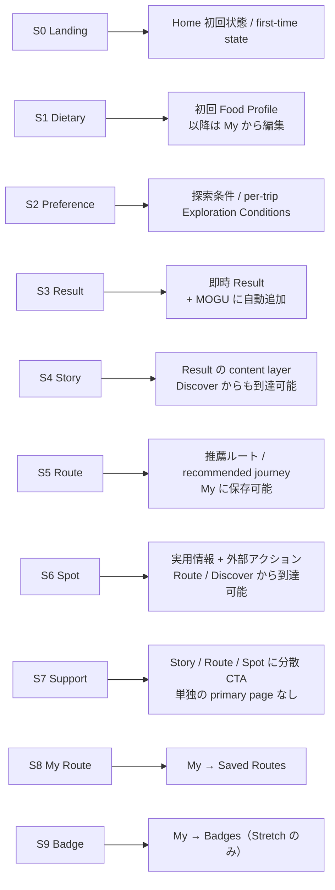
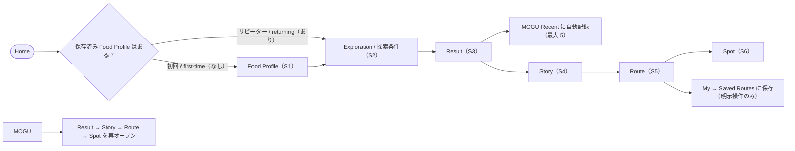

# TOKYO MOGU MOGU — Current App IA（現行アプリ情報設計）

## 概要 / Overview

この文書は GitHub ネイティブの Mermaid で、TOKYO MOGU MOGU の **current App IA** を図示する canonical ドキュメントです。

Source of truth：

- Issue #92（reusable `Home / Discover / MOGU / My` の current App IA）
- `docs/specs/product/hackathon-product-contract.md`（Current App IA / S0–S9 mapping / Architecture・Data Boundary）
- `docs/specs/product/approved-ui-fidelity.md`（S0–S9 → App IA mapping）
- `docs/specs/product/product-scope-invariant.md`（Product scope / architecture invariant）
- `src/app/AppShell.tsx`（常設ボトムナビ / persistent bottom nav）
- `src/app/AppRouter.tsx`（ルートテーブル / route table）

図と prose は上記が述べている内容のみを表現し、新しい UX / Product 挙動を発明しません。日本語をデフォルトとし、Product 用語は英語表記を併記します。

---

## 1. Persistent Primary Navigation / 常設プライマリーナビゲーション

Persistent primary navigation は **`Home / Discover / MOGU / My`**（`src/app/AppShell.tsx` の `tmm-nav`）。各タブは 1 つの separation of user information を所有します。

**Support は分散 CTA、Legacy nav は superseded**：S7 Support Hub は単独の primary page を持たず、Story / Route / Spot に分散した support CTA として実装されます。`/support` は direct URL のみで到達可能です。旧ナビ `Home / Diagnosis / Support / My Route` は superseded で、履歴 / 互換性のため direct URL のみ保持されます。

---

## 2. S0–S9 → Current App IA Mapping / 履歴画面の現在配置

S0–S9 は履歴的な journey framing です。Issue #92 はこれらを current App IA へ以下のように再配置します（authoritative mapping table）。

---

## 3. First-time / Returning Journey + MOGU Recent / 初回・リピーターの流れ

Issue #92 の First-time / Returning flow です。Result 作成時は MOGU Recent に自動追加され、MOGU からはその `Result → Story → Route → Spot` の文脈を再オープンできます（Back nav は MOGU へ戻り、新しい診断には向かいません）。

> Implementation detail（`src/pages/HomePage.tsx`）：Home の primary CTA は、保存済み Food Profile が存在しない場合 `/food-profile` へ、存在する場合 `/explore` へ遷移します。Recent 履歴（MOGU）は Home には重複表示されません。

---

## 4. Architecture Invariant / アーキテクチャ不変条件

- 本 IA は **Okutama / Wasabi 専用ではありません**。shared IA / routing / persistence / i18n / provenance は geography-independent で、複数の Tokyo Region × FoodCulture を扱えます。
- 奥多摩 / 東京わさび の hard-code は demo fixtures / demo canonical content / demo tests にのみ存在します。
- 新しい検証済み Region × FoodCulture（例：青梅 × 日本酒、八王子 × 地域野菜）は主に data / content / configuration の追加で表現可能で、shared contract の redesign を必要としません。
- Okutama × Tokyo Wasabi は **2026-08-23 Hackathon Demo Golden Path のみ**であり、Product domain を狭めません。

---

## 5. Route Table（参考）/ ルートテーブル

`src/app/AppRouter.tsx` のルートテーブルと、current App IA 上の役割（primary-nav destination / direct URL のみ / legacy）。

| Route | Page | App IA 上の役割 |
|---|---|---|
| `/` | LandingPage | Home 初回状態（S0、primary nav） |
| `/home` | HomePage | Home 開始地点（legacy route / fallback） |
| `/discover` | DiscoverPage | Discover（primary nav） |
| `/mogu` | MoguPage | MOGU（primary nav） |
| `/my` | MyPage | My（primary nav） |
| `/explore` | ExplorationWizardPage | Exploration / 探索条件（S2） |
| `/explore/result` | ResultPage | Result（S3） |
| `/food-profile`・`/food-profile/edit` | FoodProfilePage | Food Profile（S1、My から編集可） |
| `/story/:foodCultureId`・`/story` | StoryPage | Story（S4） |
| `/route` | RoutePage | Route（S5） |
| `/spot/:placeId` | SpotPage | Spot（S6） |
| `/support` | SupportPage | Support（S7、direct URL のみ） |
| `/my-route` | MyRoutePage | 旧 My Route（S8、direct URL のみ） |
| `/badges` | BadgesPage | Badges（S9、Stretch） |
| `/pokedex`・`/map`・`/food-cultures/:id` | PokedexPage / MapPage / FoodCulturePage | legacy（superseded） |

---

## 6. Sources / 参照元

- GitHub Issue #92 — current App IA（`Home / Discover / MOGU / My`）と S0–S9 mapping
- `docs/specs/product/hackathon-product-contract.md` — Current App IA / S0–S9 mapping / Architecture・Data Boundary / Account・Persistence
- `docs/specs/product/approved-ui-fidelity.md` — S0–S9 → App IA mapping / fallback presentation
- `docs/specs/product/product-scope-invariant.md` — Product scope / architecture invariant
- `src/app/AppShell.tsx` — persistent bottom nav（Home / Discover / MOGU / My）
- `src/app/AppRouter.tsx` — route table
- `src/pages/HomePage.tsx` — Home の primary CTA 遷移先（Food Profile / Exploration）
