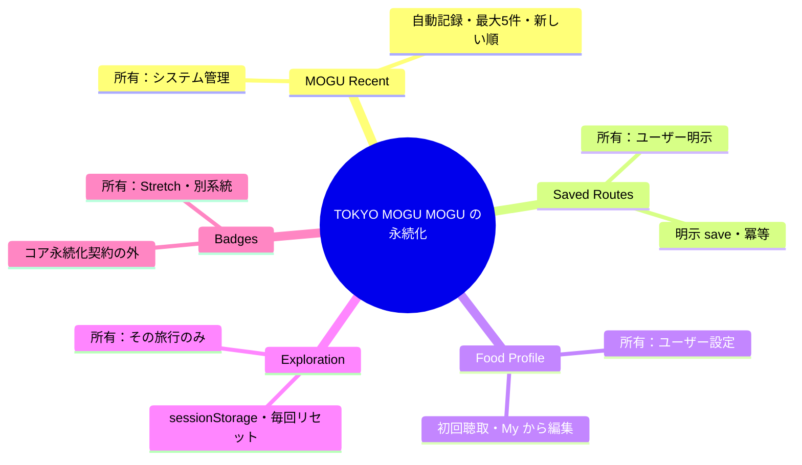
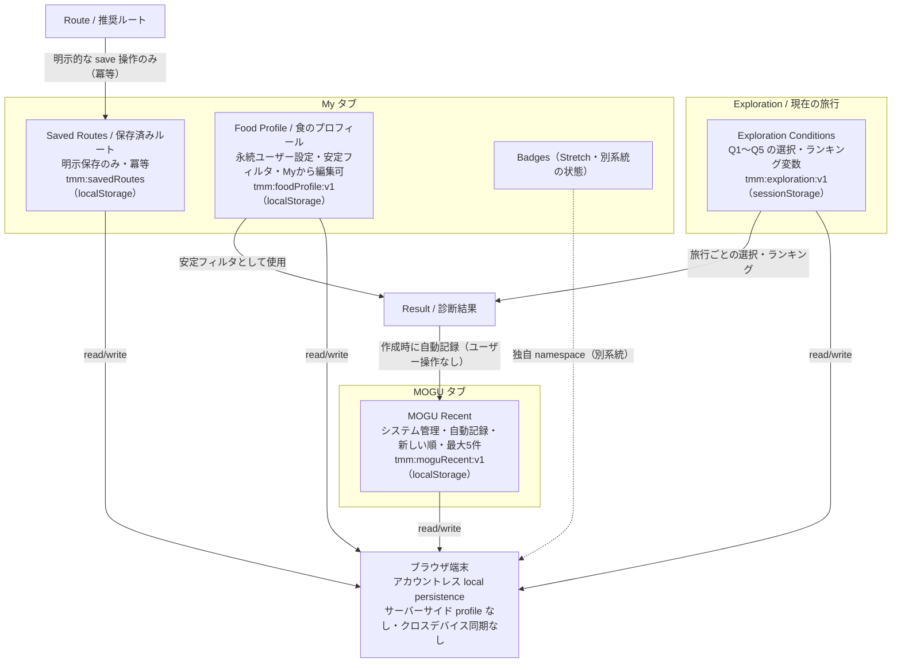
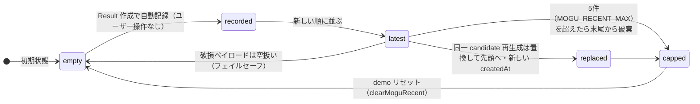

# 永続化フロー / Persistence Flow

TOKYO MOGU MOGU の **MOGU / My / Food Profile / Exploration** における
保存・ライフサイクル・所有（ownership）の関係を表す図。

- 出典（current authority）: `docs/specs/product/hackathon-product-contract.md`
  の「Account / Persistence」、GitHub Issue #92 の「Persistence Boundaries」、
  および各 persistence モジュールの実装。
- この図は「その出典が述べていることだけ」を表す。新規の UX / Product 挙動は
  追加しない。

## 前提：アカウントレス local persistence

- 永続化はすべてブラウザ上の **localStorage / sessionStorage** のみ。
- **サーバーサイド profile なし・クロスデバイス同期なし**。
- Google Auth は再利用可能な infra として残してよいが、コア journey の必須要件ではない。

## 所有と永続化領域（概要）

**核心の区別**: **MOGU Recent（システム管理）** と **Saved Routes（ユーザー明示）** は、
同じアカウントレス local persistence を共有する lower-level helper を使うことが
あっても、**意味論・永続化ともに別概念**である（#92 / 契約の明記）。

## 永続化フロー全体図

凡例: 実線矢印 = 書き込み経路（作成 / 更新）、破線矢印 = 別系統・別 namespace。

補足:

- **Result → MOGU Recent**: Result が正常に生成された時点で **自動記録**される
  （ユーザー操作なし、Save 不要）。
- **Route → Saved Routes**: **明示的な save 操作のみ**が書き込む
  （save / unsave は冪等）。
- **読み取り面**: MOGU Recent は **MOGU タブ**、Saved Routes は
  **My → Saved Routes**、Food Profile は **推薦の安定フィルタ**および
  **My → Food Profile 編集**。
- MOGU Recent の各エントリは **Result → Story → Route → Spot** を再オープンできる
  だけの文脈を保持する。保存済み Route は Story / Spot に戻れるが、
  **Saved Story / Saved Spot の別コレクションは存在しない**。
- Food Profile は推薦 / マッチ理由のみに使う。**安全（allergy-safe 等）の保証では
  決してない**。

## MOGU Recent のライフサイクル

- **read**（MOGU 一覧 / 再オープン）は状態を変更しない。
- 同一 candidate の重複は「複製」ではなく「置換 + 先頭へ移動 + 新しいタイムスタンプ」。
- 破損 / stale ペイロードは安全側に**空として扱う**。

## 領域ごとの比較表

| 領域 | 所有（ownership） | storage key | 媒体 | 保持ルール | ライフサイクル | 読み取り面 |
|---|---|---|---|---|---|---|
| **MOGU Recent** | システム管理（自動） | `tmm:moguRecent:v1` | localStorage | 最大5件・新しい順・同一 candidate は置換して先頭へ | create（Result 自動記録）/ read / update（置換・末尾破棄）/ remove（demo reset） | MOGU タブ（Result → Story → Route → Spot を再オープン） |
| **Saved Routes** | ユーザー明示（手動） | `tmm:savedRoutes` | localStorage | 上限なし・save/unsave 冪等 | create（明示 save）/ read / remove（明示 unsave） | My → Saved Routes（Route → Story / Spot に戻れる） |
| **Food Profile** | ユーザー設定（永続） | `tmm:foodProfile:v1` | localStorage | 単一 profile・破損時は「なし」扱い | create（初回聴取）/ read（推薦フィルタ）/ update（My から編集）/ remove（demo reset） | 推薦の安定フィルタ / My → Food Profile 編集 |
| **Exploration Conditions** | その旅行のみ（一時） | `tmm:exploration:v1` | sessionStorage | 毎回リセット・旅行を越えて永続しない | create（新規旅行）/ read（ウィザード + Result）/ update（Q1〜Q5 回答）/ remove（新規開始時にクリア） | Exploration ウィザード / Result |
| **Badges** | Stretch・別系統 | 独自 namespace（キー未固定） | localStorage（想定） | earned / unearned（未実装・Stretch） | コア永続化契約の外 | My → Badges |

## 読み手への注意（別軸の区別）

- 本図の「ライフサイクル」は **persistence / 保存のライフサイクル**。
  GitHub Issue #170 の **lifecycle axes** は **content slice**（Region × FoodCulture）の
  `maturity / visibility / releaseRole` の話であり、persistence とは別軸。
  本図は両者を混同しない。
- demo は決定論的（seed/reset から再現可能）。リセット関数
  （`clearMoguRecent` / `clearSavedRoutes` / `clearFoodProfile`）は demo 用。

## 出典 / Sources

- `docs/specs/product/hackathon-product-contract.md`（「Account / Persistence」ほか）
- GitHub Issue #92（Persistence Boundaries / Current App IA）
- GitHub Issue #170（content-slice の lifecycle axes — persistence とは別軸）
- `src/lib/mogu-recent.ts`（`tmm:moguRecent:v1`、`MOGU_RECENT_MAX = 5`）
- `src/lib/saved-routes.ts`（`tmm:savedRoutes`、`Array<{ routeId, savedAt }>`）
- `src/lib/food-profile-storage.ts`（`tmm:foodProfile:v1`）
- `src/pages/s0s3/exploration-session.ts`（`tmm:exploration:v1` / sessionStorage）
- `src/lib/exploration.ts`（ExplorationAnswers Q1〜Q5）
- `docs/specs/product/badge-contract.md`（Badges = Stretch・別系統の状態）
