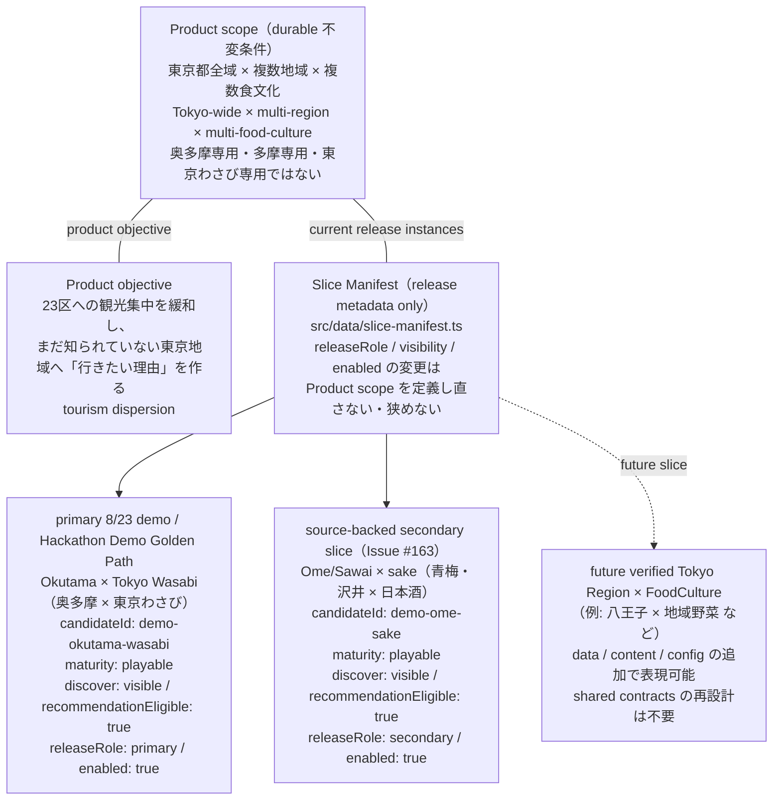
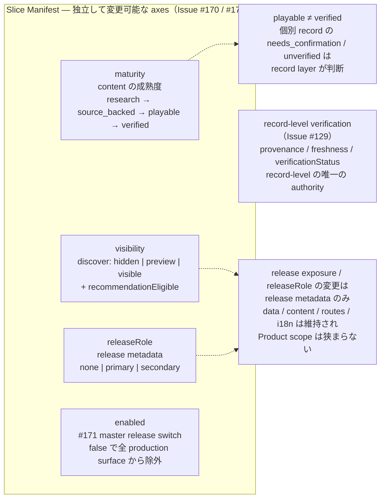

# Product Scope と 8/23 Demo の階層図 / Product scope vs 2026-08-23 demo hierarchy

このドキュメントは TOKYO MOGU MOGU の **durable Product scope** と **2026-08-23 Hackathon demo / release scope** の関係を可視化したものです。新しい UX / Product 挙動は定義しません。記載内容は以下の source のみを反映しています。

- `docs/specs/product/product-scope-invariant.md`（Issue #112）
- `docs/specs/product/hackathon-product-contract.md`
- `src/data/slice-manifest.ts`（Issue #170 / #171）
- `src/data/demo-recommendation.ts`（Issue #123 / #127 / #163）
- Issue #129（record-level verification / provenance）

---

## 1. 全体階層 / Product scope と current release slices

上段の **Product scope**（東京都全域 × 複数地域 × 複数食文化）は durable な不変条件で、奥多摩・多摩・東京わさび専用ではありません。Product objective は tourism dispersion（23 区への観光集中を緩和し、まだ知られていない東京地域へ「行きたい理由」を作る）です。

中段の **Slice Manifest** は release / lifecycle の metadata を保持するだけで、scope を定義しません。下段の 2 スライスは **8/23 release の現行インスタンス**です。

- **Okutama × Tokyo Wasabi** は **Hackathon Demo Golden Path**（presentation anchor / primary 8/23 demo）。これは demo の content 選定・content freeze・deterministic E2E golden path・delivery 最適化のための選択であり、**Product の地理的範囲・FoodCulture 範囲・唯一の有効な推薦結果**ではありません。
- **Ome/Sawai × sake** は **source-backed secondary slice**（Issue #163）。default で `enabled` となり、Discover / recommendation に参加する secondary expansion proof です。

未来の verified Tokyo Region × FoodCulture は同じ manifest の仕組みに data / content / config を追加する形で表現でき、IA / routing / persistence / recommendation / i18n / provenance の shared contracts を再設計する必要はありません。

---

## 2. 独立した権威 / Slice Manifest の axes と record-level verification

- Slice Manifest は **verification state を持たない**。record-level の provenance / freshness / `verificationStatus` は Issue #129 の contract が record-level の唯一の authority です。
- `maturity`・`visibility`・`releaseRole` は互いに独立して変更できます。maturity から visibility を自動推論しません。
- `playable` は record-level の verified を意味しません。slice が playable でも、個別 record は record layer が確認するまで `needs_confirmation` / unverified のままです。
- release exposure / `releaseRole` の変更は release metadata のみで、canonical data / content / routes / i18n は維持されます。Product scope を狭める操作ではありません。

### 各 axis / authority のまとめ

| axis / authority | 意味 | 値 | 備考 |
|---|---|---|---|
| `maturity` | 内容の成熟度（content がどこまで整っているか） | `research → source_backed → playable → verified` | record-level verification の代替ではない |
| `visibility` | どの Product surface に露出してよいか | `discover: hidden / preview / visible` + `recommendationEligible` | maturity から自動推論しない。`visible` のみ production 露出 |
| `releaseRole` | 現在の release / demo における役割 | `none / primary / secondary` | release metadata のみ。content maturity と独立に変更可 |
| `enabled`（#171 master switch） | release の master on/off | `true / false` | `false` で全 production surface から除外。data / content / routes / i18n は維持 |
| record-level verification（#129） | 個別 record の provenance / freshness / `verificationStatus` | 既存 #129 contract に従う | Slice Manifest の外部。record-level の唯一の authority。`playable` ≠ `verified` |

---

## 3. 用語ガードレール / terminology guardrail

推奨（preferred）:

- `Hackathon Demo Golden Path: Okutama × Tokyo Wasabi`
- `primary 8/23 demo` / `primary Hackathon MVP / demo: Okutama × Tokyo Wasabi`（presentation anchor）
- `source-backed secondary / expansion slice: Ome/Sawai × sake`
- `Tokyo-wide multi-region × multi-food-culture Product`
- `release-switchable secondary slice`（Issue #171）

避ける（avoid as current normative wording）:

- `MVP = Okutama × Tokyo Wasabi` を Product scope として提示すること
- `Product scope = Okutama / Tama / Wasabi`
- `Ome/Sawai replaces the team MVP`（team が明示的に決定しない限り）
- `secondary slices are hidden by default`

---

## 4. 参照 source / sources

- `docs/specs/product/product-scope-invariant.md`
- `docs/specs/product/hackathon-product-contract.md`
- `src/data/slice-manifest.ts`
- `src/data/demo-recommendation.ts`
- [Issue #112 — Product scope / demo boundary](https://github.com/nurockplayer/tokyo-mogu-mogu/issues/112)
- [Issue #170 — Slice Manifest lifecycle axes](https://github.com/nurockplayer/tokyo-mogu-mogu/issues/170)
- [Issue #129 — provenance / freshness / verification states](https://github.com/nurockplayer/tokyo-mogu-mogu/issues/129)
