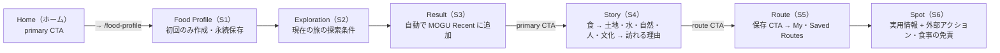
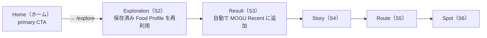
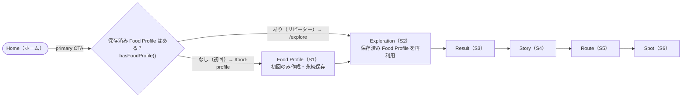
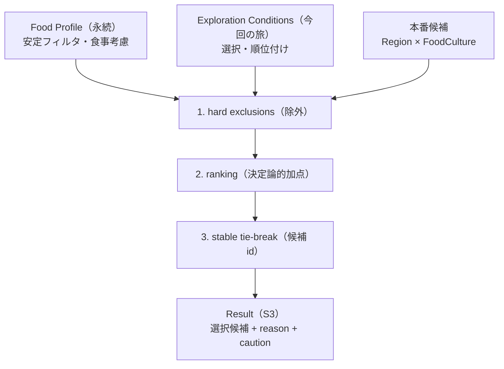
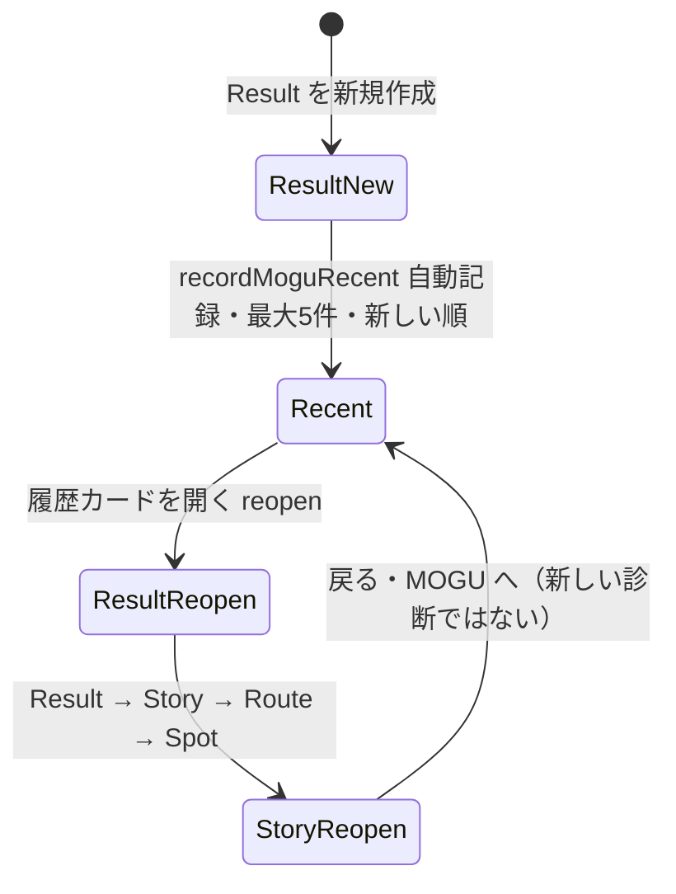

# TOKYO MOGU MOGU — First-time / Returning コア・ユーザーフロー（Core User Flow）

## 概要 / Overview

この文書は GitHub ネイティブの Mermaid で、TOKYO MOGU MOGU の **初回（First-time）／リピーター（Returning）のコア・ユーザーフロー** を図示する canonical ドキュメントです。current App IA の全体像（`Home / Discover / MOGU / My`）は `docs/diagrams/app-ia.md` にあり、本図はその対としてコアジャーニーに特化します。

Source of truth：

- GitHub Issue #92（First-time / Returning Flow、`Result = Food Profile + Exploration Conditions`、Persistence Boundaries）
- GitHub Issue #181（「既存の first-time / returning routing behavior を維持」）
- `docs/specs/product/hackathon-product-contract.md`（Current App IA (Issue #92) / Core Journey / Recommendation Boundary / Account・Persistence / Safety Boundary）
- `docs/specs/product/approved-ui-fidelity.md`（S3 / S4 / S5 / S6 / S7 提示 + サポート分散）
- `docs/specs/product/recommendation-contract.md`（Result 生成パイプライン）
- `src/pages/HomePage.tsx`（初回 / リピーターのルーティング）
- `src/pages/s0s3/ResultPage.tsx`（Result → `recordMoguRecent` 配線）・`src/lib/mogu-recent.ts`（自動記録・最大 5 件）
- `src/lib/saved-routes.ts`（明示的保存）
- `src/pages/MoguPage.tsx`（reopen 配線・戻る → MOGU）・`src/pages/s0s3/exploration-session.ts`（Exploration は sessionStorage の per-trip 状態）

図と prose は上記が述べている内容のみを表現し、新しい UX / Product 挙動を発明しません。日本語をデフォルトとし、Product 用語は英語表記を併記します。S0–S9 の画面名は履歴的なフレーミングであり、current App IA 上の配置は Issue #92 の mapping に従います。

---

## 1. First-time Flow / 初回フロー

初回ユーザー（保存済み Food Profile なし）は **Home → Food Profile → Exploration → Result → Story → Route → Spot**（Issue #92）。

---

## 2. Returning Flow / リピーターフロー

リピーター（保存済み Food Profile あり）は **Home → Exploration → Result → Story → Route → Spot**（Issue #92）。保存済み Food Profile を再利用し、Food Profile の再作成は不要です。

---

## 3. 合成図：Home からの分岐（Combined）

両フローの分岐点は **Home の primary CTA** です。実装（`src/pages/HomePage.tsx`）では `hasFoodProfile()` で遷移先を決めます。どちらの経路も **Exploration → Result** に合流し、以降の Story → Route → Spot は共通です。

> Implementation detail（`src/pages/HomePage.tsx`）：Home の primary CTA は、保存済み Food Profile が存在しない場合 `/food-profile` へ、存在する場合 `/explore` へ遷移します。クリック時には `beginNewExploration()` が前回の探索回答をクリアするため、Exploration は「新しい旅」として始まります。

---

## 4. Result の意味と生成（Result = Food Profile + Exploration Conditions）

契約（Issue #92 / `recommendation-contract.md`）により：

> **Result = Food Profile（安定フィルタ） + Exploration Conditions（今回の旅の選択・順位付け）**

- **Food Profile** は persistent なローカル設定。初回に尋ね、以降の訪問で再利用され、`My → Food Profile` から編集できます。
- **Exploration Conditions** は per-trip（今回の旅）の現在の状態。新しい探索のたびにリセットされます。
- **MOGU Recent** はシステム管理（下記 §5）。Saved Routes とは別の意味論 / 永続性です。

### 図 4-1 — Result 生成パイプライン

`recommendation-contract.md` の入力と処理順です。`src/lib/recommendation.ts` は純粋・ローカル・決定論的なベースラインです。

8/23 デモには production-ready な候補が **2 件**（奥多摩 × 東京わさび / 青梅・沢井 × 日本酒）あります（`src/data/slice-manifest.ts` で両方 `enabled` + `recommendationEligible`）。golden path の固定回答（refreshing / nature 系）にマッチするのはわさび profile のみなので、Result は決定的に **奥多摩 × 東京わさび** が選ばれます。rich / sweet・伝統志向で回答したユーザーは同じエンジンで **青梅・沢井 × 日本酒** に到達できます。この決定論は「回答 profile × デモデータ」の選択であり、永続的な推薦ドメインの制約ではありません（Product scope は東京都全域 × 複数地域 × 複数食文化）。

> Note: `docs/specs/product/recommendation-contract.md` は current main に合わせて更新済みです（本番候補 2 件・golden path の決定論は回答 profile 由来）。本図も current main に従います。

---

## 5. MOGU Recent（最近のおすすめ）の挙動

- **Result の新規作成成功時に自動記録**（`recordMoguRecent`、ユーザーの保存操作は不要）。
- 最大 **5 件**（`MOGU_RECENT_MAX = 5`）、新しい順。同じ候補を再作成した場合は重複させず既存エントリを先頭へ移動します。
- MOGU のカードは **Result → Story → Route → Spot** の文脈を再オープンします。
- 再オープンしたコンテンツからの戻る（Back）は **MOGU へ戻る**（`backTo=/mogu`）ので、新しい診断には向かいません。再オープンは MOGU Recent に再記録しません（`?from=mogu` は new recommendation ではなく reopen）。

### 図 5-1 — MOGU Recent ライフサイクル

> MOGU は browse だけでは書き込みません。成功した Result の生成（ResultPage → `recordMoguRecent`）のみが Recent に記録されます。MOGU Recent と My・Saved Routes は distinct semantic / persistence（§6）です。

---

## 6. Story / Route / Spot の意味とサポート分散

| 画面 | 意味 | 補足 |
|---|---|---|
| **Story（S4）** | Result のコンテンツ層：食 → 土地・水・自然・人・文化 → 訪れる理由 | **Discover からも到達可能**（`/story/:id?backTo=/discover`） |
| **Route（S5）** | 地域訪問を実行可能にする推奨ジャーニー | **明示的保存**（save-this-itinerary CTA）で **My → Saved Routes** へ |
| **Spot（S6）** | 実用情報 + 外部アクション | **Route / Discover から到達可能**（`/spot/:id?from=discover`）。食事の免責を表示 |

- **保存**：Route の保存は明示的操作のみ（`src/lib/saved-routes.ts`、`tmm:savedRoutes`）。MOGU Recent の自動記録とは別の意味論 / 永続キー。保存した Route は Story / Spot へ戻れます（Saved Story / Saved Spot コレクションは MVP に存在しません）。
- **サポート CTA**：S7 Support Hub は単独の primary page を持ちません。サポート CTA は **Story / Route / Spot に分散配置**されます（Story：共有 / 貢献の理解 / ルート表示、Route：保存 / 訪問計画、Spot：予約 / 購入 + 地域貢献）。購入 / 予約は MVP では外部リンク優先です。
- **食事の安全境界**：Result（S3）と Spot（S6）には「**詳細は現地・店舗に直接確認してください**」に相当する免責を表示します。食事制限の入力は推奨 / マッチ理由のみに使い、安全性の保証としては提示しません。

---

## 7. 永続性の境界（Persistence Boundaries）

| データ | ライフサイクル | 永続キー / 場所 |
|---|---|---|
| **Food Profile** | persistent ローカル設定（初回に尋ね、以降再利用、`My → Food Profile` から編集） | localStorage |
| **Exploration Conditions** | per-trip 現在の状態（探索ごとにリセット） | sessionStorage（`tmm:exploration:v1`） |
| **MOGU Recent** | システム管理（最大 5 件・自動・新しい順） | localStorage（`tmm:moguRecent:v1`） |
| **Saved Routes** | 明示的なユーザー保存のみ | localStorage（`tmm:savedRoutes`） |

---

## Sources / 参照元

- GitHub Issue #92 — First-time / Returning Flow、`Result = Food Profile + Exploration Conditions`、Persistence Boundaries
- GitHub Issue #181 — first-time / returning routing behavior の維持
- `docs/specs/product/hackathon-product-contract.md` — Current App IA (Issue #92) / Core Journey / Recommendation Boundary / Account・Persistence / Safety Boundary
- `docs/specs/product/approved-ui-fidelity.md` — S3 / S4 / S5 / S6 / S7 の提示 + サポート分散
- `docs/specs/product/recommendation-contract.md` — Result 生成パイプライン
- `src/pages/HomePage.tsx` — Home の primary CTA 遷移先（`hasFoodProfile()`）
- `src/pages/s0s3/ResultPage.tsx` — Result → `recordMoguRecent` 配線 / reopen 判定
- `src/lib/mogu-recent.ts` — 自動記録・`MOGU_RECENT_MAX = 5`
- `src/lib/saved-routes.ts` — 明示的保存（`tmm:savedRoutes`）
- `src/pages/MoguPage.tsx` — reopen 配線・戻る → MOGU
- `src/pages/s0s3/exploration-session.ts` — Exploration は sessionStorage の per-trip 状態
- `docs/diagrams/app-ia.md` — current App IA 全体図（本図の対）
