# Issue #262 — 375px visual evidence

Baseline: `92961451eab824f11c784f99204d45951bd31c7a`
Implementation head: recorded in the pull request.

The `figma-*.png` files are read-only exports captured from the live KiKi
inspection on 2026-08-22 and retained at `/tmp/tmm-figma-263.u3stCn`. Direct
Figma MCP requests from this implementation environment continue to return
`INVALID_ARGUMENT`, so no newer live export was fabricated. `before-*` and
`after-*` are fresh production-build captures at 375 × 812.

| Surface | Figma reference | Before | After | Change observed |
| --- | --- | --- | --- | --- |
| Landing (`1:95`) |  |  |  | Removes demo toolbar from the visual surface and restores the full-bleed 100dvh landing composition. |
| Story (`52:3995`) |  |  |  | Changes the dark editorial masthead to the photo-first white reading surface and adds the accessible overlay back target. |
| Route (`119:681`) |  |  | 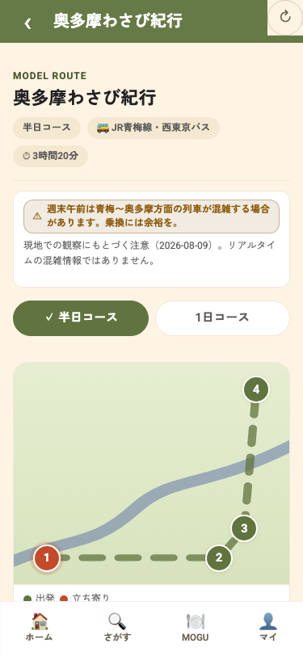 | Captured after the actual Story → Route CTA; the 53px forest app header is now the only Route-level Back control. |
| Spot (`125:1752`) |  |  |  | Uses a full-bleed hero composition and the accessible overlay back target. |

## Fresh guided-flow captures

These captures use a clean first-run state, Japanese locale, the controlled
#257 targets, and the production bundle at 375 × 812. The #257 test also
asserts exactly one enabled tutorial choice per beat; visible non-target
choices remain disabled.

### Food Profile

| Modal | Active interview | Completed interview turn | Summary |
| --- | --- | --- | --- |
| 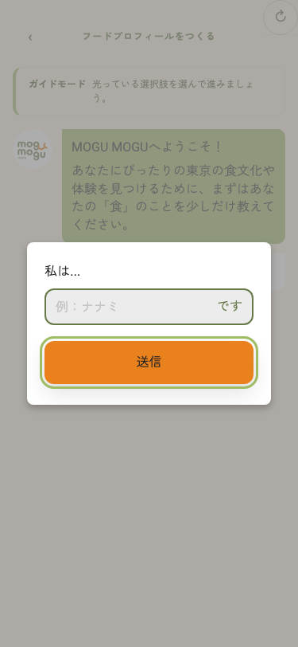 | 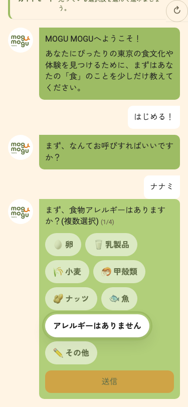 | 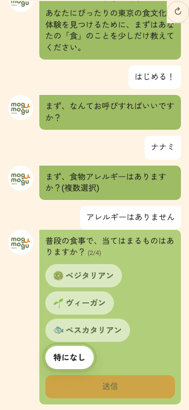 | 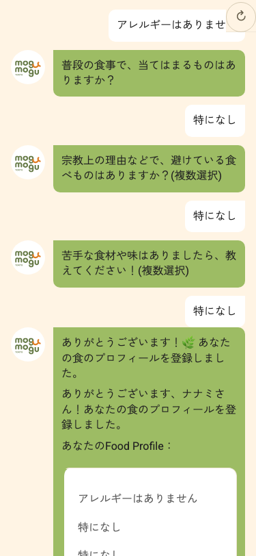 |

### Exploration Conditions — five beats

| 1. Experience | 2. Departure | 3. Travel time | 4. Duration | 5. Taste + theme |
| --- | --- | --- | --- | --- |
| 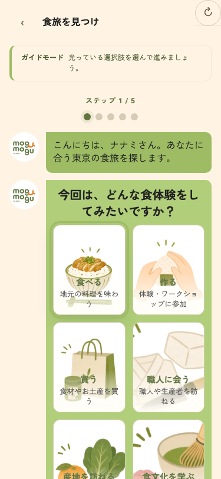 | 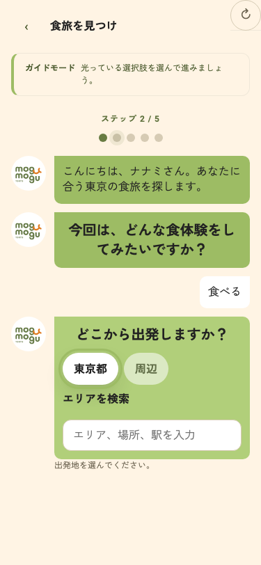 | 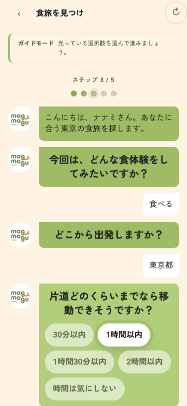 | 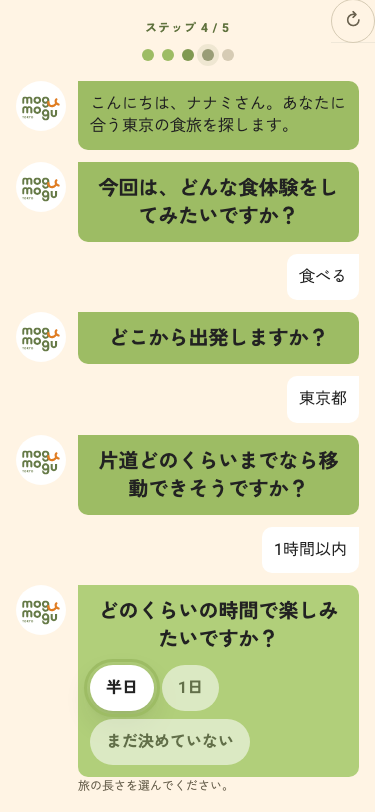 | 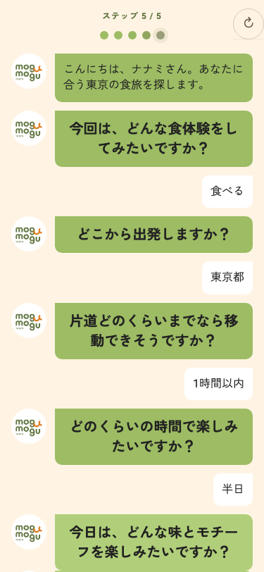 |

### Result, shell, and Route

| Real #255 score-free Top 3 | PrototypeShell + bottom navigation | Story → Route |
| --- | --- | --- |
|  | 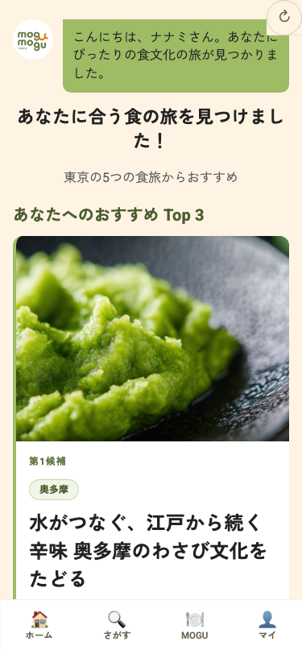 |  |

The result/shell captures retain three real ranked journeys with no scores.
The Route capture was reached by clicking Story's Route CTA, not by a direct
`/route` entry; its only caller-aware Back target is the 44px control in the
green header. Candidate identity continues through Story → Route → Spot.

### Localized 53px Route header

The long Fussa route label is captured in each shipping locale. The header
keeps a 44px Back target, one 53px row, no horizontal overflow, and a
single-line ellipsis before the fixed reset lane.

| ja | en | zh-TW |
| --- | --- | --- |
| 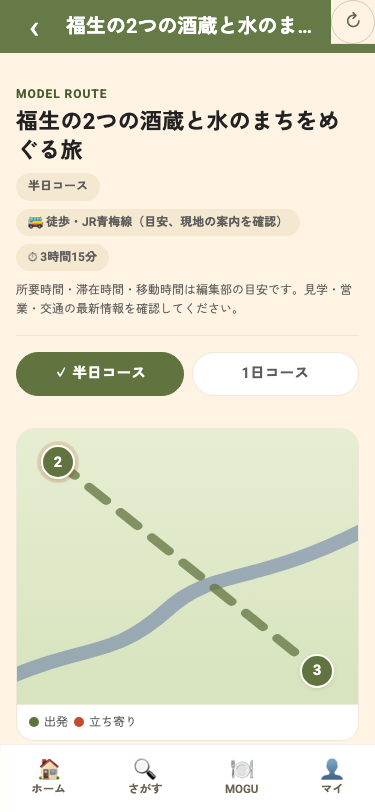 | 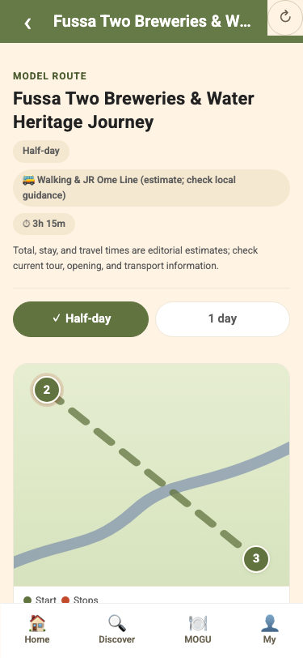 | 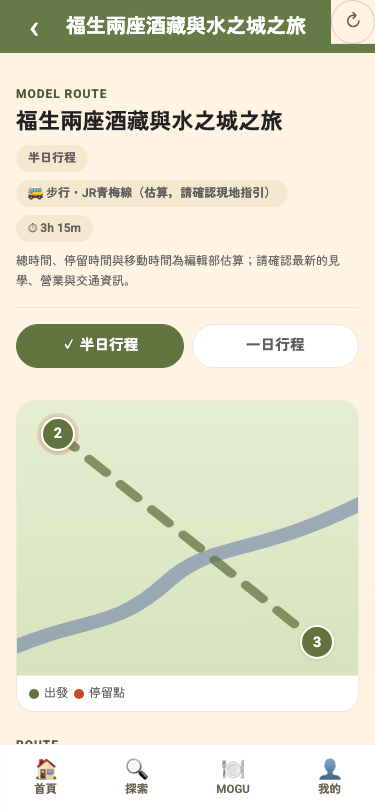 |

The guided browser gate also measures the fixed top-right reset against the
active conversation turn after Food Profile → Exploration navigation. It must
not intersect that actionable content; the initial Exploration scroll position
is reset before the first beat renders.

## Intentional remaining deltas

- Result remains the score-free real ranked Top 3 required by #255, rather than
  Figma's two-card 96%/91% fixture.
- Guided mode still makes only the #257 target actionable. Non-target choices
  are not re-enabled for visual parity.
- Story keeps the #265 source-backed `needs_confirmation` evidence only in
  Story; it is not copied into Result or Route.
- Route's rendered map and Spot's hero visual remain the existing honest
  product assets. The live exports contain image assets not available through
  this environment's Figma MCP, so this change does not misrepresent a full
  frame capture as a reusable source asset.
- Direct comparison of these new guided-flow captures with the current KiKi
  file is still blocked by the MCP error above. They are product evidence, not
  a claim that a connected human/live-Figma review has completed.
