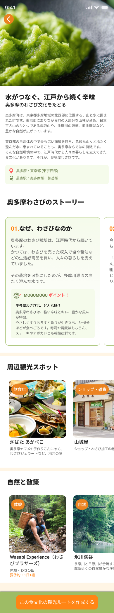
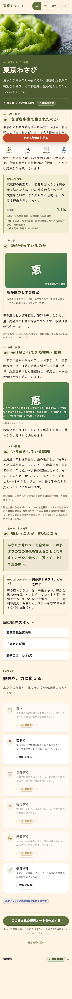
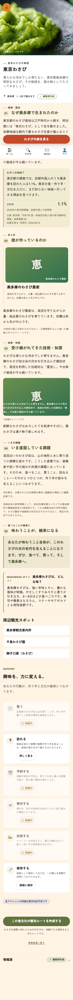
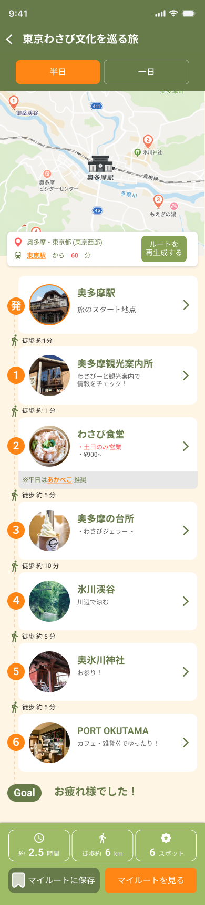
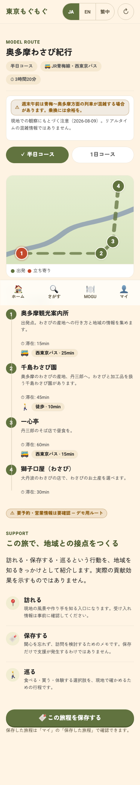
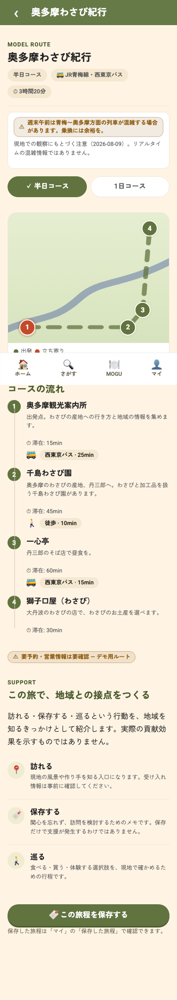
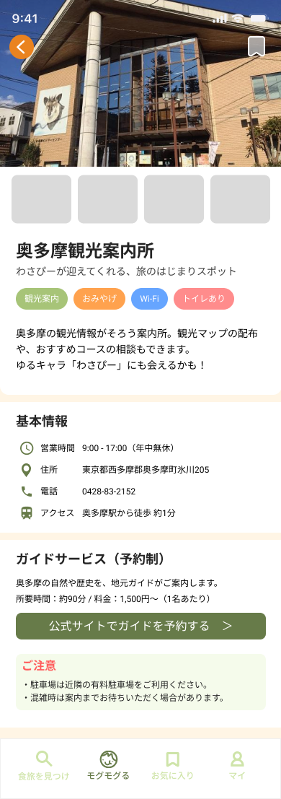
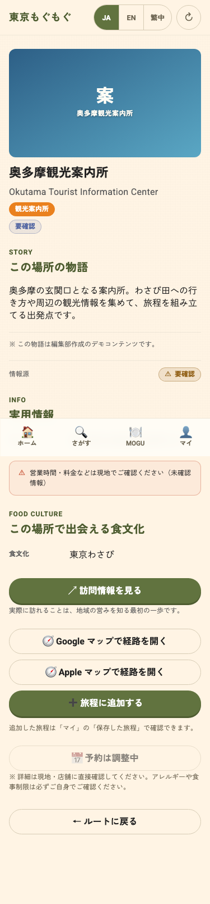
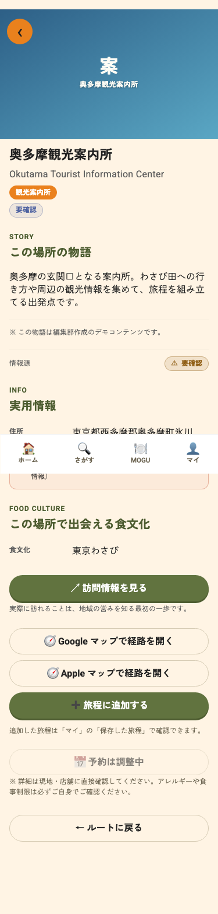

# Issue #262 — 375px visual evidence

Baseline: `92961451eab824f11c784f99204d45951bd31c7a`  
Implementation head: recorded in the pull request.

The `figma-*.png` files are read-only exports captured from the live KiKi
inspection on 2026-08-22 and retained at `/tmp/tmm-figma-263.u3stCn`. Direct
Figma MCP requests from this implementation environment returned
`INVALID_ARGUMENT`, so no newer live export was fabricated. `before-*` and
`after-*` are fresh production-build captures at 375 × 812.

| Surface | Figma reference | Before | After | Change observed |
| --- | --- | --- | --- | --- |
| Landing (`1:95`) |  |  |  | Removes demo toolbar from the visual surface and restores the full-bleed 100dvh landing composition. |
| Story (`52:3995`) |  |  |  | Changes the dark editorial masthead to the photo-first white reading surface and adds the accessible overlay back target. |
| Route (`119:681`) |  |  |  | Adds the 53px forest app header and corrects the map aspect ratio. |
| Spot (`125:1752`) |  |  |  | Uses a full-bleed hero composition and the accessible overlay back target. |

## Intentional remaining deltas

- Result remains the score-free real ranked Top 3 required by #255, rather than
  Figma's two-card 96%/91% fixture.
- Guided mode still makes only the #257 target actionable. Non-target choices
  are not re-enabled for visual parity.
- Story keeps the #265 source-backed `needs_confirmation` evidence only in
  Story; it is not copied into Result or Route.
- Route's rendered map and Spot's hero visual remain the existing honest
  product assets. The live exports contain image assets not available through
  this environment's Figma MCP, so this change does not misrepresent a full
  frame capture as a reusable source asset.
- Food Profile and all five Exploration states are governed by the existing
  #257 interaction layer; their direct live Figma recapture is blocked by the
  MCP error above and requires a connected KiKi session before visual sign-off.
